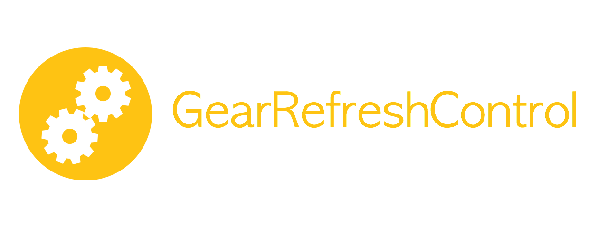

<p align="center">
  
</p>

[](http://cocoapods.org/?q=gearrefreshcontrol)
[](https://github.com/Carthage/Carthage)


A custom animation for the UIRefreshControl. Inspired by this [Dribble shot](https://dribbble.com/shots/1974767-gear-powered-pull-to-refresh-animation?list=animated&sort=popular&timeframe=now&offset=19) and [this tutorial](http://www.jackrabbitmobile.com/design/ios-custom-pull-to-refresh-control/). 

<p align="center">
  <a href='https://appetize.io/app/a9042664hahfqdukecqy1hqzpw' alt='Live demo'>
    
  </a>
</p>

# Screenshot


# Usage
Install through [Cocoapods](http://cocoapods.org)

```
pod 'GearRefreshControl', '~> 0.2'

use_frameworks!
```

Setup your `refreshControl`:

```swift
override func viewDidLoad() {
    super.viewDidLoad()
    gearRefreshControl = GearRefreshControl(frame: self.view.bounds)
    gearRefreshControl.addTarget(self, action: "refresh", forControlEvents: UIControlEvents.ValueChanged)
    self.refreshControl = gearRefreshControl
}
```

Update state:

```swift
override func scrollViewDidScroll(scrollView: UIScrollView) {
    gearRefreshControl.scrollViewDidScroll(scrollView)
}
```

Stop the animation on completion:
```swift
self.gearRefreshControl.endRefreshing()
```

##Customization

You can customize the color of the control by setting the `gearTintColor` property:

```swift
gearRefreshControl.gearTintColor = .redColor()
```

Checkout the sample project for the full implementation.

#Author
[Andrea Mazzini](https://twitter.com/theandreamazz). I'm available for freelance work, feel free to contact me. 

Want to support the development of [these free libraries](https://cocoapods.org/owners/734)? Buy me a coffee ☕️ via [Paypal](https://www.paypal.me/andreamazzini).  

#Contributors
Thanks to [everyone](https://github.com/andreamazz/GearRefreshControl/graphs/contributors) kind enough to submit a pull request. 

#MIT License

	Copyright (c) 2015 Andrea Mazzini. All rights reserved.

	Permission is hereby granted, free of charge, to any person obtaining a
	copy of this software and associated documentation files (the "Software"),
	to deal in the Software without restriction, including
	without limitation the rights to use, copy, modify, merge, publish,
	distribute, sublicense, and/or sell copies of the Software, and to
	permit persons to whom the Software is furnished to do so, subject to
	the following conditions:

	The above copyright notice and this permission notice shall be included
	in all copies or substantial portions of the Software.

	THE SOFTWARE IS PROVIDED "AS IS", WITHOUT WARRANTY OF ANY KIND, EXPRESS
	OR IMPLIED, INCLUDING BUT NOT LIMITED TO THE WARRANTIES OF
	MERCHANTABILITY, FITNESS FOR A PARTICULAR PURPOSE AND NONINFRINGEMENT.
	IN NO EVENT SHALL THE AUTHORS OR COPYRIGHT HOLDERS BE LIABLE FOR ANY
	CLAIM, DAMAGES OR OTHER LIABILITY, WHETHER IN AN ACTION OF CONTRACT,
	TORT OR OTHERWISE, ARISING FROM, OUT OF OR IN CONNECTION WITH THE
	SOFTWARE OR THE USE OR OTHER DEALINGS IN THE SOFTWARE.
	
